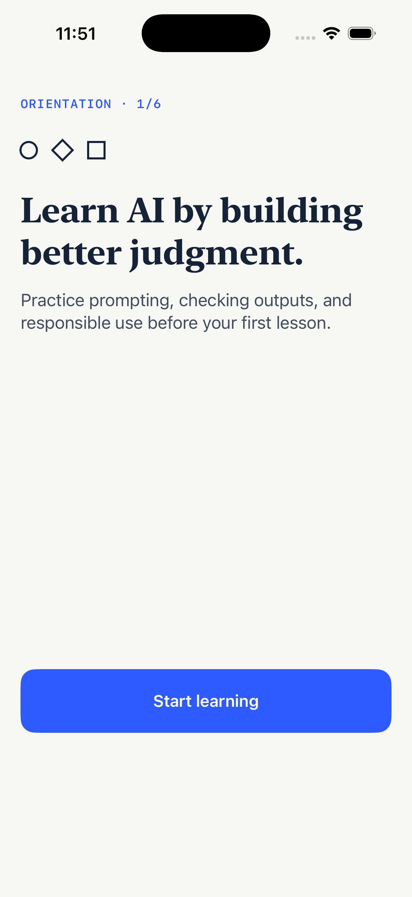
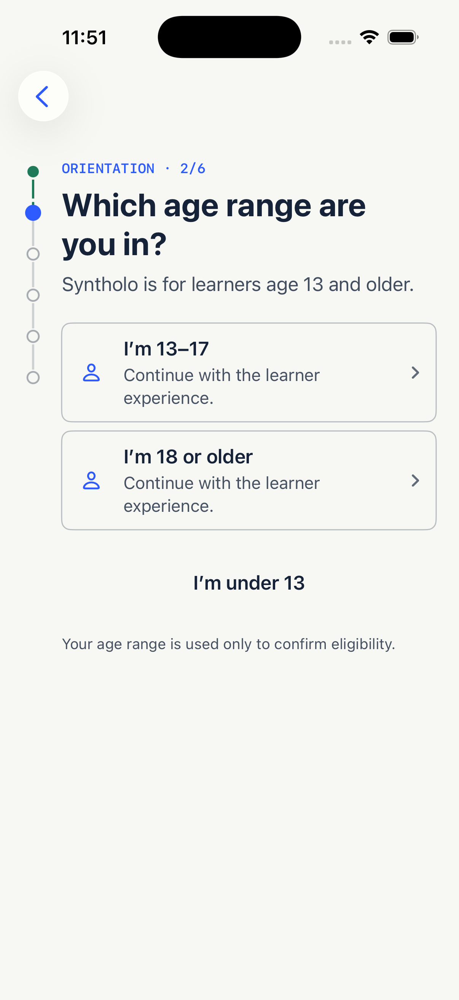
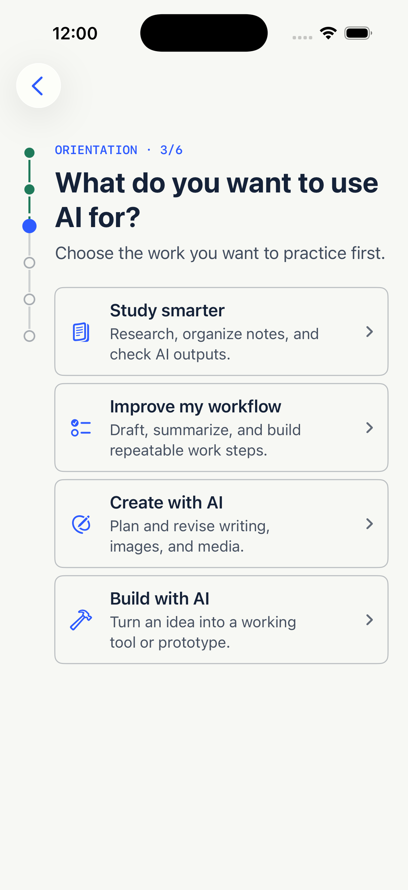
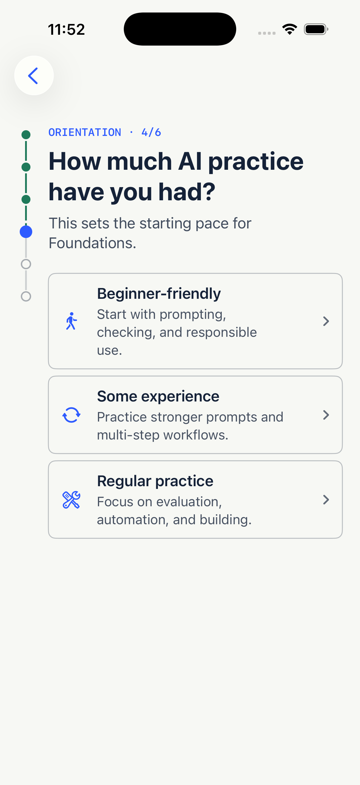
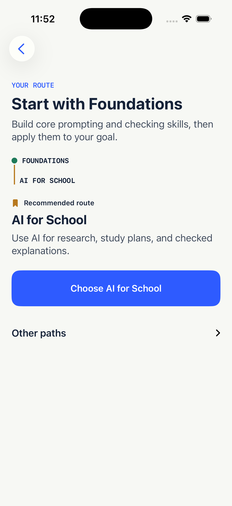
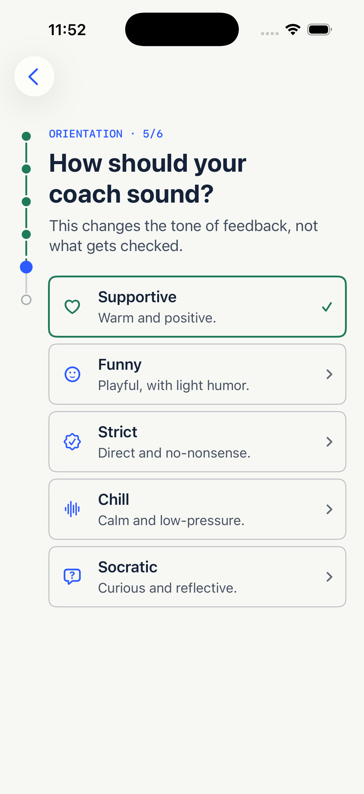
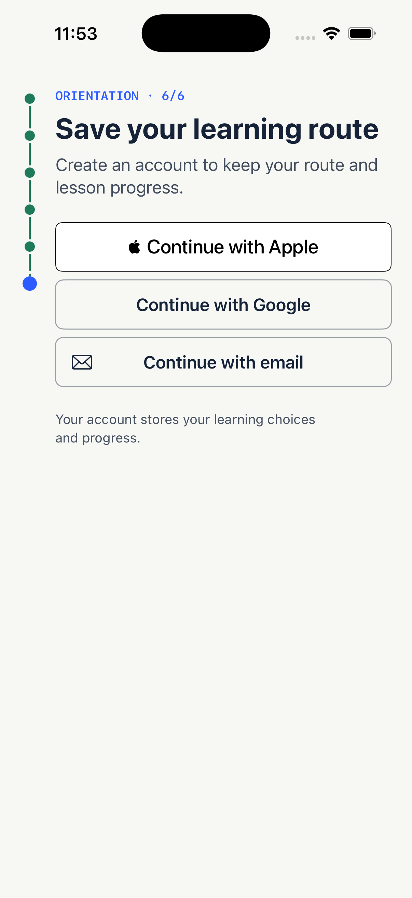
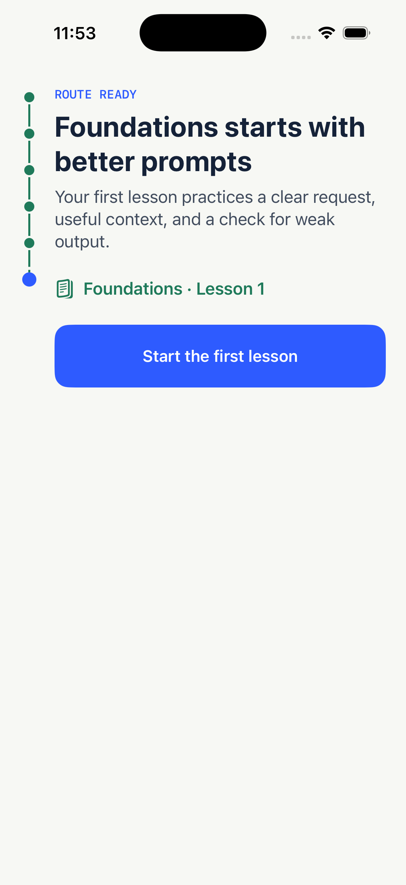
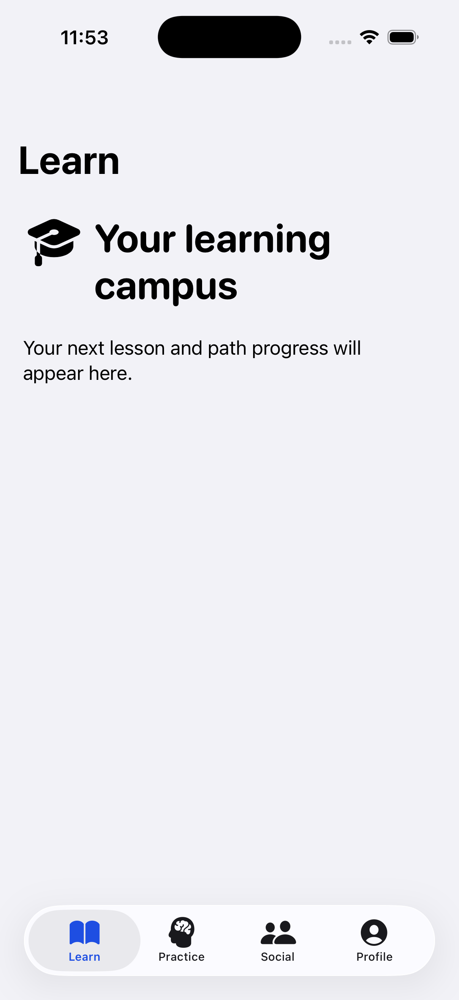

# Syntholo iOS launch-readiness report

**Audit date:** August 30, 2026  
**Binding specification:** `docs/superpowers/specs/2026-08-25-syntholo-product-bible.md`  
**Audit scope:** Repository, Product Bible alignment, canonical automated gate, current simulator flow, UX/accessibility risk, SwiftUI implementation quality, and launch delivery plan.

## Product goal

Ship Syntholo 1.0 as a trustworthy, accessible, native iPhone school for practical AI skills where a learner aged 13+ can complete the full Book III first-session and daily-learning loops, retain progress safely across interruption and connectivity changes, understand why work was scored, reach an honest free limit, purchase or restore Pro, use bounded social features safely, control or delete their data, and pass every Product Bible release gate through `GATE-STORE`.

This goal is intentionally narrower than the Book II north star. Launch does **not** require leagues, leaderboards, team quests, shared streaks, full five-path depth, free-text social, an accredited certificate system, Android, iPad optimization, or a web learner app.

## Executive verdict

Syntholo has a high-quality, freshly verified Phase 0 foundation and a substantially complete Phase 1 identity/onboarding slice. The current app is **not an internal alpha yet** because the learning product begins after the point where implementation stops.

The repository is healthy enough to build on: every enforced suite has current passing evidence, the implemented onboarding is visually coherent, and the SwiftUI baseline is modern and generally correct. The next move is not a visual rewrite. It is to finish the content platform and then build the learning engine behind the existing first-lesson handoff.

No Product Bible milestone is currently satisfied:

- `GATE-ALPHA` requires Phases 0–4 and a working onboarding → lesson → coach → sync → offline-recovery loop.
- `GATE-TF-CLOSED` requires engagement, subscriptions, bounded social, critical accessibility, and legal/support foundations.
- `GATE-TF-EXPANDED` requires operations, deletion/export, downloads, load evidence, and editorial QA.
- `GATE-STORE` requires release operations, privacy/App Review assets, account management, monitoring, and launch-quality reliability.

## Post-audit remediation checkpoint

The highest-priority Phase 1 reliability findings from the initial audit have now been remediated without changing the Product Bible scope:

- Onboarding draft load, save, and clear failures now produce typed recoverable state instead of being silently discarded.
- Retry preserves the learner's exact pending choices, blocks unsafe progress after a failed initial load, and remains available across the signed-in handoff when clearing fails.
- Persistence recovery is announced accessibly, including an explicit retry control.
- Fixed user-facing enum copy now uses compile-time-localizable resources, and intended uppercase copy is authored in the String Catalog rather than transformed at runtime.
- The local repository now has a preserved baseline on `main` at commit `b0ce17d`; no remote is configured yet.

The complete canonical `./scripts/test.sh` gate passed after those changes on August 30, 2026:

| Gate | Post-remediation result |
| --- | ---: |
| Swift unit tests | 106 passed, 0 failed, 0 skipped |
| Functional UI journeys | 18 passed, 0 failed, 0 skipped |
| AppShell accessibility audits | 28 passed, 0 failed, 0 skipped |
| Onboarding accessibility audits | 11 passed, 0 failed, 0 skipped |
| Firestore Rules | 20 passed, 0 failed, 0 cancelled, 0 skipped |

The 28 AppShell accessibility methods run in isolated Xcode sessions/result bundles because grouped Xcode 26 UI-audit runs could terminate one worker and hang finalization. Every isolated method passed. The recurring LLDB debugger-version messages remained non-failing Xcode tooling noise.

Phase 1 still requires daily-goal/settings completion, live development/staging Firebase configuration, live Apple/Google/email provider tests, minimum-iOS CI evidence, and physical-device accessibility sign-off.

## Phase 2 validation-foundation checkpoint

The synthetic-only schema and validation foundation is now implemented. It includes the normative authoring and pre-server publication shapes, RFC 8785 digest vectors, graph/DAG and scoring-contract validation, deterministic Firestore-shape conversion, exact limits and transaction-budget enforcement, safe CLI diagnostics, and a checksum-pinned Gitleaks 8.30.1 gate over full local history, ignored and non-ignored first-party worktree files, generated output, direct app contents, extracted binary strings, and normalized plists.

The implementation checkpoint is preserved on `main` at commit `7b76f87`.

Fresh aggregate evidence on August 30, 2026 is:

| Gate | Task 2 result |
| --- | ---: |
| Curriculum content contract | 73 passed, 0 failed, 0 cancelled, 0 skipped |
| Swift unit tests | 106 passed, 0 failed, 0 skipped |
| Functional UI journeys | 18 passed, 0 failed, 0 skipped |
| AppShell accessibility audits | 28 passed, 0 failed, 0 skipped |
| Onboarding accessibility audits | 11 passed, 0 failed, 0 skipped |
| Firestore Rules | 20 passed, 0 failed, 0 cancelled, 0 skipped |

The then-latest `./scripts/test.sh` invocation was interrupted when `testSocialHitRegionAudit` failed after an anomalous 112-second run. The same isolated test then passed three consecutive reruns in 23.7–26.9 seconds, and every remaining shell accessibility, onboarding accessibility, and Rules check passed in the resumed gate. This historical interruption remains disclosed; the later Task 3 checkpoint below supplies the required uninterrupted canonical pass.

This checkpoint does **not** complete Phase 2. Curriculum Rules, Swift models/digests, cache/repository/store/UI, analytics, owner approval, and authorized staging proof remain open. No original learner-facing curriculum or live Firebase content write was created.

## Phase 2 publication/rollback checkpoint

The emulator-only idempotent publisher and rollback path is now implemented on `main` at commit `ec8ac97` and independently cleared by contract and security reviews. It provides exact environment/operator identity, strict source scanning and sealed-byte parsing, create-only immutable documents, monotonic version heads, catalog-rooted atomic publication and rollback, deterministic audit/replay/collision behavior, injected-failure atomicity, safe diagnostics, and dynamic isolated emulator ports. Production remains disabled and the checked-in command path cannot perform a live write.

One final uninterrupted `./scripts/test.sh` invocation passed on iPhone 17 Pro / iOS 26.5:

| Gate | Historical Task 3 result |
| --- | ---: |
| Curriculum content contract | 73 passed, 0 failed, 0 cancelled, 0 skipped |
| Operator identity | 32 passed, 0 failed, 0 cancelled, 0 skipped |
| Publication/rollback lifecycle | 38 passed, 0 failed, 0 cancelled, 0 skipped |
| Swift unit tests | 106 passed, 0 failed, 0 skipped |
| Functional UI journeys | 18 passed, 0 failed, 0 skipped |
| AppShell accessibility audits | 28 passed, 0 failed, 0 skipped |
| Onboarding accessibility audits | 11 passed, 0 failed, 0 skipped |
| Firestore Rules | 20 passed, 0 failed, 0 cancelled, 0 skipped |
| **Aggregate** | **326 passed** |

Before that final invocation, a tab-group transition reproduced a SpringBoard `Busy` preflight denial before the Practice audit body could launch. The same audit passed after an explicit boot-readiness wait. The canonical harness now derives the exact simulator ID from the passed functional result, pins later audit destinations to it, and performs a fail-closed boot-wait → targeted shutdown → boot-wait at each tab group and before onboarding. The final invocation then passed all 28 AppShell audits, including the previously anomalous Social hit-region audit, without retrying or masking a failed test.

At documentation HEAD `315d027`, a post-documentation Gitleaks 8.30.1 run found no leak across all seven commits, the first-party worktree, 304.22 KB of direct content examined in the Debug simulator `Syntholo.app` bundle, or 3.44 MB of extracted strings/normalized plists. A separate diagnostic scan of the entire 1.04 GB `DerivedData` tree reported 93 matches; redacted path/rule triage placed every match in downloaded Firebase/gRPC/GoogleSignIn source, their test fixtures/code signatures, or copied third-party private headers. None was in first-party source or the scanned Debug simulator app bundle. This does not certify a signed release archive. `npm audit --omit=dev` remains at zero production vulnerabilities; the nine moderate development-tool findings remain on the existing dependency ledger because the proposed forced fix is a breaking Firebase CLI downgrade.

This checkpoint does **not** complete Phase 2. Curriculum Rules, Swift parity/cache/repository/store/UI, analytics, original reviewed content, approved staging identity, device publication/load/rollback evidence, minimum-iOS CI, and named owner approvals remain open. Product still has not recorded which of School, Work, Creation, or Build is the deep launch specialization, so original curriculum and every staging/production write remain prohibited.

## Phase 2 exact-read Rules checkpoint

The emulator-scoped curriculum Rules contract is implemented on `main` at commit `5e94dc0`. Authenticated clients may perform exact gets of the nine learner-readable curriculum paths only when the requested document satisfies the frozen shallow schema, publication marker, launch locale, identifier, type, timestamp, scalar, and list bounds. Allowed missing exact paths return not-found. Every list/query and every client create, update, or delete is denied, as are evaluation contracts, version heads, publication audit data, authoring namespaces, and unknown paths. The 20 existing profile tests and final catch-all deny remain intact, and `firestore.indexes.json` remains empty.

The Rules deliberately do not claim to prove nested content unions, ordering or uniqueness, cross-document graph integrity, canonicalization, or SHA-256 recomputation. The trusted Node publisher already proves those invariants before publication; Task 5 must prove the learner-relevant subset again in Swift before rendering or cache replacement.

One uninterrupted canonical `./scripts/test.sh` invocation passed on iPhone 17 Pro / iOS 26.5 after the Task 4 implementation:

| Gate | Task 4 result |
| --- | ---: |
| Curriculum content contract | 73 passed, 0 failed, 0 cancelled, 0 skipped |
| Operator identity | 32 passed, 0 failed, 0 cancelled, 0 skipped |
| Publication/rollback lifecycle | 38 passed, 0 failed, 0 cancelled, 0 skipped |
| Swift unit tests | 106 passed, 0 failed, 0 skipped |
| Functional UI journeys | 18 passed, 0 failed, 0 skipped |
| AppShell accessibility audits | 28 passed, 0 failed, 0 skipped |
| Onboarding accessibility audits | 11 passed, 0 failed, 0 skipped |
| Firestore Rules | 31 passed, 0 failed, 0 cancelled, 0 skipped |
| **Aggregate** | **337 passed** |

The Rules RED run passed 28 of 31 tests and failed the three intended positive-read cases against the prior deny-all curriculum policy. The settled suite then passed 31/31 on Firebase CLI 15.28.1 and Java 21 using an isolated emulator port. Independent contract, security, and Rules-semantics reviews found no remaining Task 4 issue after the version-suffix and stable-ID bounds were tightened and covered at their exact 64/65-character and 10/11-digit boundaries.

This checkpoint still does **not** complete Phase 2 or any Product Bible release gate. Swift parity/cache/repository/store/UI, analytics, original reviewed content, approved staging identity, production-shaped Rules and physical-device proof, minimum-iOS CI, and named owner approvals remain open. No original learner-facing curriculum or live Firebase write was created, and the unresolved specialization still prohibits both.

## Phase 2 Swift curriculum-domain checkpoint

Phase 2 Task 5 is complete in implementation commit `f3a07ec`. The app now has a pure Swift 6, Firebase-free curriculum domain with typed stable/locale/version identifiers, exact closed `Codable` models, required-null preservation, strict JSON ingress, learner-readable scoring metadata only, RFC 8785 canonicalization, SHA-256 document/payload verification, complete learner-graph validation, and the exact `AsyncStream<CurriculumLoadEvent>` boundary. Synthetic published projections and digest vectors are test-bundle resources only; the standalone Release simulator app contains none of them.

One uninterrupted canonical `./scripts/test.sh` invocation passed on iPhone 17 Pro / iOS 26.5 after the settled implementation:

| Gate | Task 5 result |
| --- | ---: |
| Curriculum content contract | 73 passed, 0 failed, 0 cancelled, 0 skipped |
| Operator identity | 32 passed, 0 failed, 0 cancelled, 0 skipped |
| Publication/rollback lifecycle | 38 passed, 0 failed, 0 cancelled, 0 skipped |
| Swift unit tests | 118 passed, 0 failed, 0 skipped |
| Functional UI journeys | 18 passed, 0 failed, 0 skipped |
| AppShell accessibility audits | 28 passed, 0 failed, 0 skipped |
| Onboarding accessibility audits | 11 passed, 0 failed, 0 skipped |
| Firestore Rules | 31 passed, 0 failed, 0 cancelled, 0 skipped |
| **Aggregate** | **349 passed** |

The 12 focused Task 5 XCTest methods and 73 Node content tests pass against the same public projection/digest evidence. Independent contract and risk reviews found no remaining P0/P1/P2 issue after strict number syntax was aligned across runtimes, malformed-input memory was bounded, missing prerequisites gained a typed broken-reference signal, asset-size diagnostics were aligned, and positive coming-soon/null coverage was added. Full-history/worktree and standalone Release-bundle Gitleaks 8.30.1 scans were clean.

This checkpoint still does **not** complete Phase 2 or any Product Bible release gate. The app-owned cache, concrete exact-get repository, observable store/UI, preview handoff, curriculum UI/accessibility fixtures, analytics, original reviewed content, approved staging identity, production-shaped Rules/device proof, minimum-iOS CI, and named approvals remain open. No original learner-facing curriculum or live Firebase write was created, and the unresolved specialization still prohibits both.

## Phase 2 app-owned curriculum-cache checkpoint

Phase 2 Task 6 is complete in implementation commit `ba54963`. The app now owns an actor-isolated curriculum cache namespaced by environment, Firebase project, and locale. Its exact versioned envelope records source identity, save time, catalog identity/order, every learner-readable document digest, and the complete validated snapshot. Reads and replacements revalidate the complete graph and fail closed on malformed, incompatible, wrong-source, wrong-envelope, or digest-invalid data.

Invalid primary data is quarantined beside the cache with a deterministic UTC-millisecond filename. Failed writes, transient reads, quarantine failures, and quarantine-name collisions cannot promote invalid data or overwrite/delete another valid scope. Production replacement uses Foundation atomic file writing.

One uninterrupted canonical `./scripts/test.sh` invocation passed on iPhone 17 Pro / iOS 26.5 after the settled implementation:

| Gate | Task 6 result |
| --- | ---: |
| Curriculum content contract | 73 passed, 0 failed, 0 cancelled, 0 skipped |
| Operator identity | 32 passed, 0 failed, 0 cancelled, 0 skipped |
| Publication/rollback lifecycle | 38 passed, 0 failed, 0 cancelled, 0 skipped |
| Swift unit tests | 143 passed, 0 failed, 0 skipped |
| Functional UI journeys | 18 passed, 0 failed, 0 skipped |
| AppShell accessibility audits | 28 passed, 0 failed, 0 skipped |
| Onboarding accessibility audits | 11 passed, 0 failed, 0 skipped |
| Firestore Rules | 31 passed, 0 failed, 0 cancelled, 0 skipped |
| **Aggregate** | **374 passed** |

The focused `CurriculumCacheTests` suite passed 25/25. Independent code and failure-mode reviews found no remaining P0, P1, or P2 Task 6 issue after transient filesystem read errors were separated from invalid cache data so a valid primary is not quarantined on an ordinary I/O failure. Full-history and first-party worktree scans were clean.

A standalone Release simulator build succeeded. Its direct 150.10 KB app-bundle scan and 4.11 MB extracted-strings/normalized-plist scan were clean under pinned Gitleaks 8.30.1, and the two synthetic published-client fixtures plus the shared digest-vector resource were absent from `Syntholo.app`. A separate diagnostic scan of the complete 1.37 GB `DerivedData` tree reported 102 redacted matches: all were in downloaded Firebase/GoogleSignIn sources, their test fixtures or repository pack, gRPC/OpenSSL artifacts and code signatures, or copied third-party private headers. None was in first-party source or the scanned app bundle. This is strong resource-separation evidence, not signed App Store archive certification.

This checkpoint does **not** complete Phase 2 or any Product Bible release gate. The exact-get repository, observable store/UI, preview handoff, UI/accessibility fixtures, analytics, original reviewed content, staging publication/device proof, minimum-iOS CI, physical accessibility, and named approvals remain open. No specialization was selected or inferred, and no original learner content or staging/production Firebase write was created.

## Phase 2 exact-get Firestore repository checkpoint

Phase 2 Task 7's repository engineering slice is complete in implementation commit `83f6e1a`. The app now restores a fully revalidated environment/project/locale cache before forcing server-source exact gets for the compatibility header, locale catalog pointer, immutable catalog, catalog-pinned program versions, modules, lessons, learner-readable rubrics, and assets. It never resolves through mutable program pointers or requests list/query, audit, version-head, authoring, or protected evaluation data.

The production boundary normalizes Firebase values into strict `Sendable` values, preserves real timestamp nanoseconds, derives cache provenance from validated runtime and actual Firestore app metadata, performs both minimum-client preflights, validates the complete graph/digests before atomic cache replacement, and emits only the frozen saved/fresh/empty/update-required/unavailable sequence. Deterministic cancellation gates prove that cancellation winning before commit prevents mutation, while a commit that already won finishes without blocking the cancelling caller behind filesystem I/O.

One uninterrupted canonical `./scripts/test.sh` invocation passed on iPhone 17 Pro / iOS 26.5 after the settled implementation:

| Gate | Task 7 result |
| --- | ---: |
| Curriculum content contract | 73 passed, 0 failed, 0 cancelled, 0 skipped |
| Operator identity | 32 passed, 0 failed, 0 cancelled, 0 skipped |
| Publication/rollback lifecycle | 38 passed, 0 failed, 0 cancelled, 0 skipped |
| Swift unit tests | 176 passed, 0 failed, 0 skipped |
| Functional UI journeys | 18 passed, 0 failed, 0 skipped |
| AppShell accessibility audits | 28 passed, 0 failed, 0 skipped |
| Onboarding accessibility audits | 11 passed, 0 failed, 0 skipped |
| Firestore Rules | 31 passed, 0 failed, 0 cancelled, 0 skipped |
| **Aggregate** | **407 passed** |

The repository suite passed 30/30 and the combined repository/cache/runtime slice passed 69/69. Three independent reviews report no remaining P0/P1/P2 after source-provenance, malformed-path, launch-locale, permission/error-taxonomy, immutable-identity, mutation-resistant order, and cancellation/commit-gate gaps were repaired. Full-history/worktree scans and a standalone Release simulator app scan were clean; the synthetic published fixtures and shared digest vectors were absent from the app bundle.

This checkpoint still does **not** complete Phase 2 or any Product Bible release gate. The observable store/read-only UI, root preview handoff, deterministic UI repository injection, curriculum accessibility journeys, analytics, approved original content, staging publication/device proof, minimum-iOS CI, physical accessibility, and named approvals remain open. No specialization was selected or inferred, and no original learner content or staging/production Firebase write was created.

## Initial audit verification evidence (historical)

Before the remediation checkpoint above, the canonical `./scripts/test.sh` gate passed on this machine using Xcode 26.6, iPhone 17 Pro / iOS 26.5, XcodeGen 2.46.0, Node 22.23.2, npm 10.9.8, Java 21.0.12.1, Firebase CLI 15.28.1, and Firestore emulator 1.22.0.

| Gate | Fresh result |
| --- | ---: |
| Swift unit tests | 98 passed, 0 failed, 0 skipped |
| Functional UI journeys | 16 passed, 0 failed, 0 skipped |
| AppShell accessibility audits | 28 passed, 0 failed, 0 skipped |
| Onboarding accessibility audits | 10 passed, 0 failed, 0 skipped |
| Firestore Rules | 20 passed, 0 failed, 0 cancelled, 0 skipped |

The recurring `DebuggerLLDB.DebuggerVersionStore.StoreError` / `no debugger version` output is the repository's already-documented Xcode UI-test warning. It did not fail or skip tests.

After adding the pinned Phase 2 validator/Admin development dependencies, `npm audit` reports nine moderate vulnerabilities in development tooling dependency paths and zero high or critical findings. `npm audit --omit=dev` reports zero production vulnerabilities. These packages are not shipped in the iOS app, but must remain on the dependency-review ledger. Do not use a suggested forced downgrade without a separate compatibility review.

## Current standing against the Product Bible

| Phase | Standing | What is real now | What blocks exit |
| --- | --- | --- | --- |
| 0 — Foundation | Verified | Swift 6, iOS 17, iPhone-only, XcodeGen, environments, design system, four tabs, CI/test gate | Physical-device checks still matter at release, but Phase 0 engineering is sound |
| 1 — Identity/onboarding | Substantially complete | Age gate, teen/adult distinction, goal, experience, editable path recommendation, five coach modes, Apple/Google/email architecture, profile persistence, typed local-persistence recovery, and localization hardening | Live provider smoke tests, development/staging Firebase configuration, minimum-iOS CI evidence, physical VoiceOver evidence, daily-goal/settings completion |
| 2 — Curriculum platform | In progress | Frozen contract, synthetic schema/validator/digests, independently reviewed emulator-only atomic publisher/rollback, authenticated shallow exact-read Rules, pure Swift curriculum validation, actor-backed atomic app cache, and the authenticated exact-get immutable-graph repository; the uninterrupted current gate passes 407 tests | Owner approval; observable store/read-only UI, preview handoff, deterministic UI fixtures, analytics, and staging proof; chosen specialization before original content authoring or staging load |
| 3 — Learning engine | Missing | First-lesson handoff is only a seam | Player, required formats, deterministic scoring, attempts, start limits, durable queue, cache/offline recovery, progress semantics |
| 4 — AI coach | Missing | Coach-mode preference only | Moderation, immutable rubric load, structured scoring, server validation, separate tone rendering, feedback/revision/follow-up, fail-soft recovery |
| 5 — Engagement | Missing | Learn and Practice placeholders | Today mission, next action, XP, streak, daily challenge, objective review, persistence/reconciliation |
| 6 — Subscriptions | Missing | No StoreKit code or configuration | Products, localized prices, trial/renewal/cancel copy, entitlement verification, updates, pending/refund/billing states, restore/manage |
| 7 — 1.0 social | Missing | Social placeholder; hidden profile primitives exist | Opt-in friends, exact lookup/invite, requests, preset reactions, report, block, cached-removal behavior |
| 8 — Profile/operations | Missing | Profile placeholder | Settings, notifications, membership, downloads, privacy/safety, support, export, deletion, complete analytics/telemetry |
| 9 — Store hardening | Not started | CI and accessibility harness provide a strong base | App icon, privacy manifest/labels, screenshots, review assets/account, release monitoring/rollback, reliability targets, final device matrix |

## Combined UX and accessibility audit

### User goal and accessibility target

The audited user is a new adult learner using the existing AI for School test fixture, with beginner experience and the Supportive coach. This fixture is an audit scenario, not the unresolved Product Bible launch-specialization decision. The target is a clear, low-friction path from eligibility confirmation to a real first Foundations lesson, usable with VoiceOver, Dynamic Type, non-color state communication, and minimum 44-point targets.

### Step 1 — Welcome: healthy

The visual direction is original and appropriate for a school: editorial serif headline, academic ink, restrained diagram language, and one obvious action. The promise centers judgment rather than tricks, aligning with LAW-1. The screen is spacious without hiding the CTA.

Risk: “before your first lesson” creates a near-term promise the current build cannot fulfill.

### Step 2 — Age confirmation: healthy

Eligibility is explicit, under-13 is not disguised, and no birth date is requested. Teen and adult choices have large targets and readable descriptions. This is strong SHIP-AGE / LAW-15 behavior.

Risk: both allowed choices use identical descriptions, so the visible reason for distinguishing teen from adult is not explained. Keep privacy details concise, but later privacy settings should make the stricter teen defaults transparent.

### Step 3 — Goal selection: healthy

The four goals map cleanly to the Product Bible paths. Labels are plain, the examples clarify scope, and the information density remains manageable.

Risk: every row advances immediately. This is efficient, but VoiceOver focus movement after selection still needs physical-device verification.

### Step 4 — Experience selection: healthy

Experience is correctly framed as pace/explanation level rather than coach personality. This preserves DEC-7 and avoids implying that advanced learners are graded differently.

### Step 5 — Path recommendation: healthy with a terminology issue

Foundations-first sequencing is prominent, the recommendation is editable, and the route graphic is meaningfully labeled for assistive technology. The hierarchy makes the primary recommendation easy to accept without hiding alternatives.

Risk: this screen drops the numbered “Orientation” convention and uses “Your route.” That may be intentional, but the progress model becomes less predictable. The complete flow visually contains more than six meaningful screens once the handoff is included.

### Step 6 — Coach selection: healthy

All five modes are visible, Supportive defaults correctly, and selection uses border, checkmark, accessibility selected trait/value, and color together. The copy clearly states that tone does not change grading, supporting LAW-3.

### Step 7 — Account creation: healthy at fixture level

Apple, Google, and email are given comparable prominence and Apple remains present beside third-party login. The screen arrives after learner value/preferences have been established and before progress sync, aligning with SHIP-AUTH and SHIP-FIRST-LESSON ordering.

Limit: this audit used the repository's non-secret authentication fixture. Live Apple, Google, and email provider behavior was not verified.

### Step 8 — First-lesson handoff: visually healthy, functionally critical

The handoff is specific and motivating: named program, lesson number, concrete skill, and one action. Visually, this is the right bridge into the product.

Critical defect: the CTA promises “Start the first lesson,” but no lesson is started.

### Step 9 — Actual destination: blocked product loop

The action lands on a placeholder campus screen saying the lesson and progress “will appear here.” This is direct evidence that SHIP-FIRST-LESSON and the Book III new-learner loop are not implemented. It is the highest-priority product gap because it breaks the exact moment where onboarding must convert into learning value.

The tab shell itself is visually clean and readable, but Practice, Social, and Profile are also placeholders in source.

## SwiftUI Expert assessment

### Strong implementation choices

- The project uses iOS 17-era Observation correctly: `@Observable`, view-owned observable state through `@State`, and injected bindable models through `@Bindable`.
- `NavigationStack`, native `Button`, native sheet presentation, semantic SwiftUI colors, system text styles, and SF Symbols form a solid accessible baseline.
- Interactive rows use stable model identity rather than array offsets.
- `@FocusState` is private and used for the email form.
- Controls expose selected traits/values and decorative symbols are hidden where appropriate.
- No old `NavigationView`, `navigationBarItems`, generic accessibility API, or gesture-only button substitute was found.
- The current `.tabItem` implementation is appropriate for an iOS 17 deployment target. The newer `Tab` API cannot replace it unconditionally without raising the minimum OS or adding availability branches.

### SwiftUI and reliability improvements

1. **Resolved — onboarding-draft persistence errors are recoverable.** Typed load/save/clear failures, exact retry snapshots, relaunch recovery, handoff recovery, and accessible retry behavior are now covered by unit, functional UI, and accessibility tests.
2. **Resolved — fixed enum copy uses compile-time localization resources.** Fixed user-facing enum content is modeled as `LocalizedStringResource` and passed directly to SwiftUI.
3. **Resolved — localized uppercase copy is authored in the catalog.** Runtime `.textCase(.uppercase)` is no longer used for those headings.
4. **Keep state ownership private where possible.** Current local `@State` properties are private, which is good. Continue that rule in new lesson/player views.
5. **Do not adopt iOS 26-only visual APIs for launch.** The minimum remains iOS 17. Any future iOS 26 polish must be availability-gated with an iOS 17 fallback and must not fork the product's core interaction model.
6. **Do not over-centralize the future player in one observable object.** Separate narrow observable state for content, current activity, attempt/sync status, and entitlement/allowance so unrelated network or queue changes do not invalidate the whole lesson tree.

## Launch definition of done

Syntholo 1.0 is launch-ready only when all of the following are true:

### Core learner loop

- A 13+ learner completes onboarding, creates an account, and starts a real Foundations lesson in the same session.
- The lesson contains instruction and an applied check, returns deterministic or rubric-grounded feedback, supports allowed revision, and records results.
- Today shows a real next action, streak, XP, and preview that survive kill/relaunch and another device where supported.
- Already-started cached work survives expected failures and can be completed offline under Book III rules.

### Curriculum and content

- Foundations contains at least 3 modules, 12 lessons, and one structured capstone.
- One explicitly chosen specialization contains at least 2 modules and 8 real lessons.
- The other three specializations are honest catalog records with promises and “more modules arriving,” not fake lessons.
- Published lesson/rubric versions are immutable and a private draft/publish/rollback path exists.

### Integrity, AI, and safety

- Attempts receive stable IDs before submission and all rewards/allowances/entitlements are server-authoritative and idempotent.
- AI evaluation uses moderation, immutable rubrics, structured scoring, server validation, and a separate tone renderer.
- Feedback names criteria/evidence, improvement, and one next action; AI identity is visible.
- Timeouts, invalid schemas, auth expiry, sync failure, and crashes preserve learner work.
- App Check protects supported production functions and no secret ships in the client.

### Monetization and social

- Free learners see their 3-start allowance before the limit, can resume without another credit, and see an honest paywall only after value.
- StoreKit 2 supports localized prices, annual trial disclosure, verified entitlements, transaction updates, restore/manage, and all pending/failure/refund/expiry states.
- Social is opt-in and limited to friends, exact lookup/invite, preset reactions, report, and block. No leagues or free-text social ship.

### Privacy, accessibility, and operations

- In-app account deletion and export request paths work end to end.
- Notification, coach, learning, membership, downloads, privacy/safety, and support controls exist.
- Core flows pass automated audits plus physical VoiceOver, Dynamic Type, Reduce Motion, Switch Control, contrast, and target-size checks on iOS 17 and current iOS.
- Retention periods, vendor data-use restrictions, privacy manifest/labels, age rating, terms, privacy policy, and support URLs are approved.
- Required analytics are stable and validated without raw answers, submissions, prompts, transcripts, email, or private profile text.

### Release operations

- App icon and all App Store assets exist.
- StoreKit sandbox and Firebase staging/production matrices pass.
- Crash-free sessions meet 99.8% at submission; monitoring, rollback owners, reviewer account, and review notes are ready.
- Every open P0/P1 security, safety, data-loss, purchase, accessibility, and crash defect is resolved.
- `GATE-ALPHA`, `GATE-TF-CLOSED`, `GATE-TF-EXPANDED`, and `GATE-STORE` each have dated evidence and named sign-off.

## Prioritized delivery roadmap

### Milestone 1 — Make Syntholo real: Phases 2–4

1. Choose the one deep specialization and freeze the versioned curriculum/rubric contract.
2. Extend the verified emulator publisher to approved staging identity only after the Product/environment gate.
3. Render a published fixture program/module/lesson in the iPhone app.
4. Build the lesson engine around stable attempt IDs, deterministic objective scoring, durable queue states, cache/resume, credit semantics, and interruption tests.
5. Connect the current first-lesson CTA directly to the real first lesson.
6. Add the split AI evaluation pipeline, recoverable failure states, feedback, one free revision, and three free follow-ups.
7. Exit only when the full `GATE-ALPHA` loop works online, through kill/relaunch, and through supported offline recovery.

### Milestone 2 — Closed TestFlight: Phases 5–7

1. Replace Learn/Practice placeholders with Today, next mission, XP/streak, review, daily challenge, and queue state.
2. Implement daily allowance and StoreKit entitlements together so neither client UI nor purchase state can bypass the server.
3. Build bounded social from the existing hidden-profile/handle foundations: friends, requests, preset reactions, report, and block.
4. Complete critical legal/support surfaces and physical accessibility testing.

### Milestone 3 — Expanded TestFlight: Phase 8

1. Build profile/settings, notification controls, downloads, membership management, privacy/safety, help, deletion, and export.
2. Load and editorially QA the complete 1.0 curriculum.
3. Complete analytics, Crashlytics/operational dashboards, load tests, retention policy implementation, and failure drills.

### Milestone 4 — App Store: Phase 9

1. Finish icon, privacy manifest, Store listing, subscription disclosures, screenshots, support/privacy URLs, review account, and review notes.
2. Run the oldest/current OS device matrix, StoreKit sandbox matrix, live provider matrix, offline/upgrade/reinstall tests, and physical accessibility sign-off.
3. Freeze app/content versions, assign monitoring and rollback owners, satisfy reliability targets, and record final sign-off.

## Immediate next implementation slice

Continue the approved synthetic Phase 2 sequence. The emulator-only publisher/rollback, exact-read Rules, Swift curriculum-domain/digest-parity, app-owned cache, and exact-get Firestore repository checkpoints are complete. The next engineering checkpoint is Task 8: the observable curriculum store and honest loading/saved/fresh/empty/update-required/unavailable Learn states, followed by the read-only catalog/program/module/lesson preview UI. The first staging vertical checkpoint remains:

> A privately published, immutable Foundations fixture containing a program, module, lesson version, objective, expected duration, completion rule, still-diagram/concept content, one deterministic question, and rubric/version references syncs into the app and renders read-only from the existing first-lesson handoff.

Do not add AI, StoreKit, leagues, or a broader redesign to that checkpoint. Prove content identity and immutability first; every later attempt, score, offline recovery, and reward depends on it.

## Evidence limits

- Simulator captures verify visible layout and navigation behavior for the audited fixture, not live provider/network behavior.
- Automated accessibility audits passed, but screenshots and XCTest do not prove spoken VoiceOver focus/announcements on physical hardware.
- Only iOS 26.5 ran locally. The configured iOS 17.5 CI job remains required for minimum-OS evidence.
- Local Git provenance now begins at preserved baseline commit `b0ce17d` on `main`. No remote is configured, so upstream history, branch protection, and remote CI provenance still cannot be verified.
